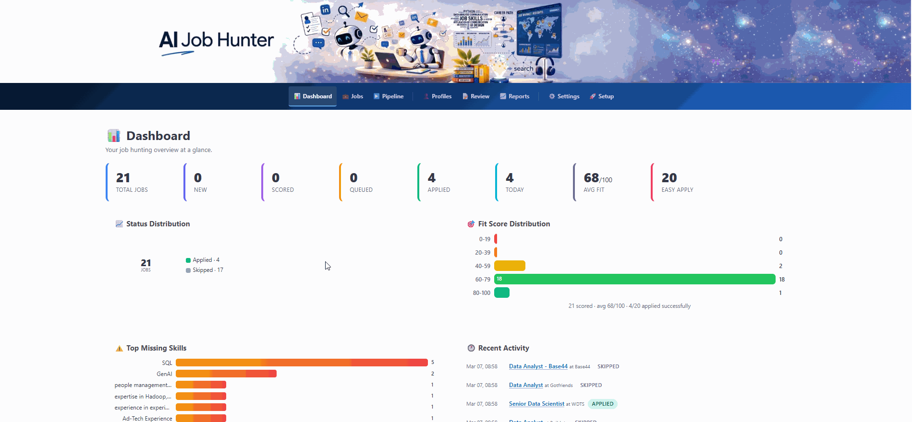

# AI Job Hunter

Automated LinkedIn job discovery, scoring, and application powered by LLM-based
resume matching, browser automation, and market intelligence.

AI Job Hunter finds fresh LinkedIn jobs matching your background, scores each one
against your resume using embedding similarity and LLM evaluation, and — when a
job passes your thresholds — applies via Easy Apply automatically. A built-in
Market Intelligence engine analyses technology trends, builds role archetypes,
and matches your skills against market demand.

---

## Table of Contents

- [Features](#features)
- [Prerequisites](#prerequisites)
- [Installation](#installation)
- [Getting Started — Step by Step](#getting-started--step-by-step)
  - [Step 1: Install & Configure](#step-1-install--configure)
  - [Step 2: Generate Your Profile](#step-2-generate-your-profile)
  - [Step 3: Log in to LinkedIn](#step-3-log-in-to-linkedin)
  - [Step 4: Test with a Dry Run](#step-4-test-with-a-dry-run)
  - [Step 5: Run for Real](#step-5-run-for-real)
  - [Step 6: Market Intelligence (Optional)](#step-6-market-intelligence-optional)
- [Web GUI](#web-gui)
- [Authentication & Multi-User](#authentication--multi-user)
- [Scheduling](#scheduling)
- [Email Notifications](#email-notifications)
- [Operating Modes](#operating-modes)
- [CLI Reference](#cli-reference)
  - [Global Flags](#global-flags)
  - [Core Commands](#core-commands)
  - [Market Intelligence Commands](#market-intelligence-commands)
- [Application Pipeline](#application-pipeline)
- [Market Intelligence Pipeline](#market-intelligence-pipeline)
- [Configuration](#configuration)
  - [Environment Variables](#environment-variables)
  - [Profile Files](#profile-files)
- [Data Directory](#data-directory)
- [Data Models](#data-models)
- [Project Structure](#project-structure)
- [Testing](#testing)
- [Docker Deployment](#docker-deployment)
- [Safety & Ethics](#safety--ethics)
- [Development Roadmap](#development-roadmap)
- [License](#license)

---



## Features

| Feature | Description |
|---|---|
| **Profile generation** | Extract skills & experience from resume PDF + LinkedIn (URL or PDF) via LLM |
| **Job discovery** | Cookie-based LinkedIn search with pagination, CSS + JS fallback parsing |
| **AI scoring** | Embedding similarity + LLM fit evaluation (0–100) with skill gap analysis |
| **Industry preferences** | Boost/penalise scores based on preferred and disliked industries |
| **Easy Apply automation** | Multi-step wizard with LLM-powered form filling for arbitrary questions |
| **Challenge detection** | Pauses on captcha, marks job as BLOCKED — no bypass attempts |
| **Market Intelligence** | Technology trend analysis, role archetypes, candidate–role matching, gap analysis |
| **Web GUI** | Full command & control dashboard (FastAPI + HTMX + Pico CSS) |
| **Multi-user auth** | JWT login, per-user settings & API keys, account management, admin panel |
| **Visual dashboard** | Donut chart, fit histogram, skill gap bars, activity timeline, market panel |
| **Scheduled runs** | APScheduler cron-based automation with configurable days, time, and pipeline mode |
| **Email notifications** | Pipeline summary emails via Resend API or SMTP (Gmail, Outlook, custom) |
| **Resume review** | AI-powered gap analysis comparing your resume to target jobs |
| **Daily reports** | Markdown + JSON summaries with stats, job tables, and market section |
| **Docker support** | Dockerfile + docker-compose with health check, volume mount, auto-restart |
| **Settings persistence** | Web UI settings saved to `.env` — survives restarts |
| **Mock mode** | Full pipeline testable offline with HTML fixtures — no API keys needed |
| **CLI** | `hunt` command with 10+ subcommands and global flags |
| **`.env` support** | API keys and settings from `.env` file |
| **SQLite database** | Job, Score, ApplicationAttempt + 13 market tables, WAL mode |

---

## Prerequisites

- **Python 3.13+**
- **[uv](https://docs.astral.sh/uv/)** — fast Python package manager
- **OpenAI API key** — for scoring, profile generation, form filling, and market extraction (not needed for mock/offline testing)

---

## Installation

```bash
git clone https://github.com/kertser/AIJobHunter.git
cd AIJobHunter
uv sync          # installs all dependencies including dev tools
```

> **Windows note:** All `uv` and `pytest` commands work the same in PowerShell. For `.env` creation, use `Copy-Item .env.example .env` instead of `cp`.

Verify the installation:

```bash
uv run hunt --help
uv run pytest -q          # 377 tests, all offline
```

---

## Getting Started — Step by Step

This is the recommended sequence to go from zero to a fully operational system.

### Step 1: Install & Configure

```bash
# Install dependencies
uv sync

# Create your .env file
cp .env.example .env          # Linux/macOS
# Copy-Item .env.example .env  # Windows PowerShell
```

Edit `.env` and set your OpenAI API key:

```
JOBHUNTER_OPENAI_API_KEY=sk-proj-...
```

Initialise the database:

```bash
uv run hunt init
```

This creates `data/job_hunter.db` and the `data/reports/` directory.

### Step 2: Generate Your Profile

The system needs to understand your background. Provide your resume (PDF) and optionally your LinkedIn profile:

```bash
# Resume + LinkedIn URL (Playwright scrapes the public profile)
uv run hunt profile --resume path/to/resume.pdf --linkedin https://www.linkedin.com/in/your-name/

# Resume + LinkedIn PDF export (if you've downloaded it)
uv run hunt profile --resume path/to/resume.pdf --linkedin linkedin.pdf

# Resume only
uv run hunt profile --resume path/to/resume.pdf
```

**Or use the web GUI:** start the server (`uv run hunt --real --dry-run serve`) and go to **http://localhost:8000** — the Setup page will guide you.

This generates two files:

| File | Purpose |
|---|---|
| `data/user_profile.yml` | Your extracted profile: name, skills, experience, desired roles, education |
| `data/profiles.yml` | Search profiles: keywords, location, seniority, scoring thresholds |

Verify what was generated:

```bash
uv run hunt profile --show
```

You can edit both files manually or via the **Profiles** page in the web GUI.

### Step 3: Log in to LinkedIn

The system uses browser cookies for authentication (no password storage):

```bash
uv run hunt login
```

A browser window opens. Log in to LinkedIn manually. Once login is detected, the browser closes and cookies are saved to `data/cookies.json`.

> **Note:** Cookies expire periodically. If discovery stops working, run `hunt login` again.

### Step 4: Test with a Dry Run

Before applying to real jobs, test the full pipeline in dry-run mode:

```bash
# Discover + score + "apply" without submitting
uv run hunt --real --dry-run run --profile default
```

This will:
1. **Discover** — search LinkedIn for jobs matching your profile keywords
2. **Score** — compute embedding similarity + LLM fit score for each job
3. **Queue** — mark qualifying jobs for application
4. **Apply (dry-run)** — walk through Easy Apply forms but stop before submitting
5. **Report** — generate a daily summary in `data/reports/`

Check the results:

```bash
# View the dashboard
uv run hunt --real --dry-run serve
# Open http://localhost:8000
```

### Step 5: Run for Real

Once you're satisfied with the scoring and job selection:

```bash
# Full pipeline — will submit applications
uv run hunt --real run --profile default
```

Or use the web GUI:

```bash
uv run hunt --real serve
# Open http://localhost:8000 → Pipeline page → click "Run Pipeline"
```

### Step 6: Market Intelligence (Optional)

After discovering and scoring some jobs, run market analysis to understand technology trends and how your skills compare to market demand:

**Via the web GUI** (easiest):

```bash
uv run hunt --real serve
# Open http://localhost:8000 → Pipeline page → click "Analyse Market"
```

**Via CLI:**

```bash
# Full market pipeline (7 steps)
uv run hunt --real market run-all --extractor openai --normalizer openai --profile default
```

This runs: Ingest → Extract → Graph → Trends → Role Model → Candidate Model → Match.

View results:
- **Web:** http://localhost:8000/market — trends, role archetypes, skill gaps, company demand
- **CLI:** `uv run hunt market report` — generates a market intelligence report in `data/reports/`
- **Job details:** each job now shows market-enhanced scoring data

---

## Web GUI

Start the web server:

```bash
uv run hunt --real --dry-run serve          # safe mode — won't submit applications
uv run hunt --real serve                    # live mode — will submit applications
uv run hunt --mock serve                    # offline testing with mock data
uv run hunt serve --host 0.0.0.0 --port 3000  # custom bind address
```

Open **http://localhost:8000** in your browser.

### Pages

| Page | Path | Description |
|---|---|---|
| **Dashboard** | `/` | Visual stats — donut chart, fit histogram, skill gap bars, activity timeline, market intelligence panel |
| **Jobs** | `/jobs` | Sortable/filterable table with bulk actions, status management, persistent sort |
| **Job Detail** | `/api/jobs/{hash}` | Full description, scores, market boost, Easy Apply button, application history |
| **Pipeline** | `/run` | Trigger Discover / Score / Apply / Full Pipeline / Market Analysis with live SSE progress |
| **Market** | `/market` | Technology trends, rising entities, role archetypes, candidate matches, company demand |
| **Profiles** | `/profiles` | Edit user profile and search profiles (skills, keywords, thresholds) |
| **Resume Review** | `/resume-review` | AI gap analysis — missing skills, improvement suggestions, quick wins |
| **Reports** | `/reports` | Browse and view daily pipeline + market reports |
| **Account** | `/account` | Personal account settings — edit display name, email, change password |
| **Settings** | `/settings` | Toggle mock/dry-run/headless, configure LinkedIn session cookies, email notifications, API keys |
| **Schedule** | `/schedule` | Cron-style automation — set time, days, pipeline mode, view run history |
| **Admin** | `/admin` | User management, profile management, database reset (admin-password protected) |
| **Setup** | `/onboarding` | Upload resume PDF + LinkedIn URL to generate profiles (first-run wizard) |

**Live progress streaming:** Pipeline and market operations stream real-time progress via Server-Sent Events (SSE) — you see each step as it happens, with keepalive pings during long operations.

---

## Authentication & Multi-User

The web GUI is login-protected. All pages (except login/register) require a valid session.

### Registration & Login

1. **First user** — when no users exist, the registration page is shown automatically. The first registered user is auto-promoted to **admin** and can optionally set the **admin panel password**.
2. **Subsequent users** — can register while `JOBHUNTER_REGISTRATION_ENABLED=true` (default).
3. **Sessions** — JWT-based via `access_token` cookie (7-day expiry). Logging in from another browser/device replaces the session.


### Account Settings

Click your **name in the top navigation bar** to open `/account`, where you can:
- Change your **display name** and **email address**
- **Change your password** (requires current password)
- View account info: user ID, role, status, registration date, last login

### Per-User Settings

Each user can override global settings from the **Settings** page:
- **OpenAI API key** — each user can set their own key
- **Runtime flags** — mock mode, dry-run, headless, slow-mo
- **Email notifications** — provider, credentials, recipient

Settings that are left unset on the user row inherit from the global `AppSettings` (`.env` file).

### Admin Panel

The admin panel (`/admin`) is protected by a standalone **admin password** (not tied to any user account). If no admin password is configured, any logged-in user can access it.

The admin panel provides:
- User management — activate/deactivate, promote/demote admin, delete users
- Database reset — erase all data and start fresh (including admin password)

Set the admin password via `JOBHUNTER_ADMIN_PASSWORD` in `.env`, during first-user registration, or from the admin panel itself.

---

## Scheduling

The built-in scheduler runs pipeline jobs automatically on a cron-like schedule. Configure it from the **Schedule** page in the web GUI or via `data/schedule.yml`.

### Configuration

| Setting | Default | Description |
|---|---|---|
| **Enabled** | off | Toggle the scheduler on/off |
| **Time of day** | `09:00` | When to run (24 h format) |
| **Days of week** | Mon–Fri | Which days to run |
| **Pipeline mode** | `full` | `discover` / `discover_score` / `full` / `market` |
| **Profile** | `default` | Which search profile to use |

### How it works

- The scheduler runs inside the web server process (APScheduler `AsyncIOScheduler`).
- Only one task runs at a time — if a pipeline is already running, the scheduled trigger is skipped.
- After each run, a summary is recorded in `data/schedule_history.yml` (capped at 100 entries).
- If email notifications are enabled, a pipeline summary email is sent after each run.

### `data/schedule.yml` example

```yaml
schedule:
  enabled: true
  time_of_day: '09:00'
  days_of_week: [mon, tue, wed, thu, fri]
  pipeline_mode: full
  profile_name: default
```

---

## Email Notifications

Receive email summaries after each scheduled pipeline run. Two providers are supported:

### Resend (recommended — simple)

1. Sign up at [resend.com](https://resend.com) (free tier: 100 emails/day)
2. Create an API key
3. In **Settings** → **Email Notifications**, select **Resend**, paste the API key, enter your email

That's it — no SMTP configuration needed.

### SMTP (advanced)

For Gmail, Outlook, or custom mail servers:

| Provider | Host | Port | TLS | Notes |
|---|---|---|---|---|
| **Gmail** | `smtp.gmail.com` | 587 | ✅ | Requires an [App Password](https://myaccount.google.com/apppasswords) |
| **Outlook** | `smtp.office365.com` | 587 | ✅ | |
| **Local relay** | `localhost` | 25 | ❌ | Leave credentials blank |

### Environment variables

| Variable | Description |
|---|---|
| `JOBHUNTER_EMAIL_PROVIDER` | `resend` (default) or `smtp` |
| `JOBHUNTER_RESEND_API_KEY` | Resend API key |
| `JOBHUNTER_NOTIFICATION_EMAIL` | Recipient email address |
| `JOBHUNTER_NOTIFICATIONS_ENABLED` | `true` / `false` |
| `JOBHUNTER_SMTP_HOST` | SMTP server hostname |
| `JOBHUNTER_SMTP_PORT` | SMTP port (default: 587) |
| `JOBHUNTER_SMTP_USER` | SMTP username (optional for relays) |
| `JOBHUNTER_SMTP_PASSWORD` | SMTP password |
| `JOBHUNTER_SMTP_USE_TLS` | `true` / `false` |

All settings can also be configured from the **Settings** page in the web GUI. Changes are persisted to `.env` automatically.

---

## Operating Modes

The system has three operating modes controlled by global flags:

| Mode | Flags | LinkedIn | Applications | Use Case |
|---|---|---|---|---|
| **Mock** | `--mock` | Local HTML fixtures | Never | Development & testing |
| **Dry-run** | `--real --dry-run` | Real LinkedIn | Stops before submit | Preview & verification |
| **Live** | `--real` | Real LinkedIn | Submits for real | Production use |

**Recommended workflow:** Start with `--mock` to verify setup, then `--real --dry-run` to preview real jobs, then `--real` when ready.

---

## CLI Reference

```
hunt [GLOBAL OPTIONS] COMMAND [COMMAND OPTIONS]
```

### Global Flags

| Flag | Default | Description |
|---|---|---|
| `--mock` | off | Use mock LinkedIn (local HTML fixtures) |
| `--real` | off | Use real LinkedIn (requires cookies) |
| `--dry-run` | off | Run without submitting applications |
| `--headless / --no-headless` | headless | Browser visibility |
| `--slowmo-ms INT` | `0` | Slow-motion delay in ms (for debugging) |
| `--data-dir PATH` | `data` | Data directory path |
| `--log-level` | `INFO` | `DEBUG` / `INFO` / `WARNING` / `ERROR` |

### Core Commands

| Command | Description |
|---|---|
| `hunt init` | Initialise database and data directory |
| `hunt login` | Open browser for manual LinkedIn login, save cookies |
| `hunt profile` | Generate or view user profile and search profiles |
| `hunt discover --profile NAME` | Discover LinkedIn jobs for a search profile |
| `hunt score --profile NAME` | Compute fit-scores for discovered jobs |
| `hunt apply --profile NAME` | Apply to qualified jobs via Easy Apply |
| `hunt run --profile NAME` | Run full pipeline: discover → score → apply → report |
| `hunt report` | Generate daily Markdown + JSON report |
| `hunt serve` | Start web GUI (default: http://localhost:8000) |

### Market Intelligence Commands

All market commands are under `hunt market`:

| Command | Description |
|---|---|
| `hunt market run-all` | Run the full 7-step market pipeline |
| `hunt market ingest` | Convert discovered jobs → market events |
| `hunt market extract -e TYPE` | Run signal extraction (`heuristic` / `openai` / `fake`) |
| `hunt market graph` | Build entity + evidence graph from extractions |
| `hunt market trends` | Compute frequency, momentum, novelty, burst |
| `hunt market role-model -n TYPE` | Build role archetypes (`heuristic` / `openai` / `fake` / `legacy`) |
| `hunt market candidate-model -p NAME` | Project user profile into candidate capabilities |
| `hunt market match -p NAME` | Match candidate against role archetypes |
| `hunt market export -f FORMAT` | Export graph (`json` / `graphml`) |
| `hunt market report` | Generate market intelligence report |
| `hunt market dialogue-list` | List dialogue sessions |
| `hunt market dialogue-evaluate` | Evaluate un-assessed dialogue sessions |

#### Key Options for `hunt market run-all`

```bash
uv run hunt --real market run-all \
    --extractor openai \        # heuristic | openai | fake
    --normalizer openai \       # heuristic | openai | fake | legacy
    --profile default           # candidate key
```

#### Examples

```bash
# Quick local test (no API key needed)
uv run hunt --mock --dry-run run --profile default

# Real LinkedIn, preview only
uv run hunt --real --dry-run run --profile backend-python

# Full pipeline, live applications
uv run hunt --real run --profile default

# Market analysis with OpenAI
uv run hunt --real market run-all --extractor openai --normalizer openai

# Market analysis with heuristic (free, no API key)
uv run hunt --real market run-all --extractor heuristic --normalizer heuristic

# Web GUI
uv run hunt --real --dry-run serve
```

---

## Application Pipeline

```
┌──────────┐    ┌───────┐    ┌───────┐    ┌───────┐    ┌────────┐
│ Discover │───>│ Score │───>│ Queue │───>│ Apply │───>│ Report │
└──────────┘    └───────┘    └───────┘    └───────┘    └────────┘
     │               │                        │
     ▼               ▼                        ▼
  LinkedIn      Embeddings +           Easy Apply wizard
  search        LLM evaluation         + LLM form filler
  + parsing     + industry prefs       (Playwright)
                + market boost
```

1. **Discover** — searches LinkedIn using your profile keywords, parses HTML results
2. **Score** — computes embedding similarity (0.0–1.0) and LLM fit score (0–100) for each job; applies industry preference boosts; optionally enriches with market opportunity signals
3. **Queue** — marks jobs as `QUEUED` if: `easy_apply=true`, fit ≥ `min_fit_score`, similarity ≥ `min_similarity`
4. **Apply** — automates the Easy Apply wizard via Playwright; LLM generates contextual answers for form questions
5. **Report** — produces daily Markdown + JSON summaries with stats, job tables, and market section

**Job statuses:** `new` → `scored` → `queued` → `applied` / `skipped` / `blocked` / `review` / `failed`

**LLM form filling:** the Easy Apply wizard encounters arbitrary questions (dropdowns, text fields, radio buttons). The system uses GPT to generate contextually appropriate answers based on your user profile.

---

## Market Intelligence Pipeline

```
┌────────┐   ┌─────────┐   ┌───────┐   ┌────────┐   ┌────────────┐   ┌───────────┐   ┌───────┐
│ Ingest │──>│ Extract │──>│ Graph │──>│ Trends │──>│ Role Model │──>│ Candidate │──>│ Match │
└────────┘   └─────────┘   └───────┘   └────────┘   └────────────┘   └───────────┘   └───────┘
                                                                         Model
```

1. **Ingest** — converts discovered jobs into market events (idempotent)
2. **Extract** — runs signal extraction on job descriptions: technologies, skills, tools, methodologies, certifications, companies (heuristic keyword matching or OpenAI LLM)
3. **Graph** — normalises entities (fuzzy matching + alias resolution), builds evidence and co-occurrence edges
4. **Trends** — computes per-entity frequency, momentum (rising/falling), novelty, and burst scores
5. **Role Model** — clusters jobs by normalised title, builds role archetypes with entity importance weights; title normalisation via heuristic rules or OpenAI LLM
6. **Candidate Model** — projects your `user_profile.yml` skills into the entity graph with confidence scoring
7. **Match** — compares your capabilities against each role archetype: success score, confidence, learning upside, mismatch risk, hard/soft/learnable gap classification; graph proximity boost

**Outputs:**
- Per-role opportunity scores with gap analysis
- Rising technology trends and skill demand signals
- Market-enhanced scoring on individual job detail pages
- Market Intelligence section in daily reports

---

## Configuration

### Environment Variables

| Variable | Required | Default | Description |
|---|---|---|---|
| `JOBHUNTER_OPENAI_API_KEY` | For real use | `""` | OpenAI API key |
| `JOBHUNTER_LLM_PROVIDER` | No | `"openai"` | LLM provider |
| `JOBHUNTER_DATA_DIR` | No | `"data"` | Path to the data directory |
| `JOBHUNTER_SECRET_KEY` | No | auto-generated | JWT signing key (auto-persisted on first run) |
| `JOBHUNTER_ADMIN_PASSWORD` | No | `""` | Admin panel password (empty = no gate) |
| `JOBHUNTER_REGISTRATION_ENABLED` | No | `true` | Allow new user registration |
| `JOBHUNTER_EMAIL_PROVIDER` | No | `"resend"` | Email provider: `resend` or `smtp` |
| `JOBHUNTER_RESEND_API_KEY` | For Resend | `""` | Resend API key |
| `JOBHUNTER_NOTIFICATION_EMAIL` | For email | `""` | Notification recipient email |
| `JOBHUNTER_NOTIFICATIONS_ENABLED` | No | `false` | Enable email notifications |
| `JOBHUNTER_SMTP_HOST` | For SMTP | `""` | SMTP server hostname |
| `JOBHUNTER_SMTP_PORT` | No | `587` | SMTP port |
| `JOBHUNTER_SMTP_USER` | No | `""` | SMTP username |
| `JOBHUNTER_SMTP_PASSWORD` | For SMTP | `""` | SMTP password |
| `JOBHUNTER_SMTP_USE_TLS` | No | `true` | Use TLS for SMTP |

> **All settings are GUI-configurable.** You can set every variable above from the **Settings** page in the web GUI — no need to manually edit `.env`. Settings saved from the GUI are automatically persisted to `.env` and survive restarts.

Create a `.env` file in the project root (or configure everything from the GUI):

```bash
JOBHUNTER_OPENAI_API_KEY=sk-proj-...
JOBHUNTER_EMAIL_PROVIDER=resend
JOBHUNTER_RESEND_API_KEY=re_...
JOBHUNTER_NOTIFICATION_EMAIL=you@example.com
```

The app reads `.env` on startup. Shell environment variables take precedence.

### Profile Files

#### `data/user_profile.yml`

Your extracted profile — generated by `hunt profile` or the Setup wizard. Editable manually or via the Profiles page.

```yaml
user_profile:
  name: Jane Doe
  first_name: Jane
  last_name: Doe
  email: jane@example.com
  phone: "555-0123"
  phone_country_code: "+1"
  title: Senior Python Developer
  summary: Experienced backend engineer with 8 years in Python ecosystems.
  skills:
    - Python
    - FastAPI
    - AWS
  experience_years: 8
  seniority_level: Senior
  spoken_languages:
    - English
    - Spanish
  programming_languages:
    - Python
    - SQL
  preferred_industries:      # Boost score for jobs in these industries
    - startups
    - healthcare
  disliked_industries:       # Penalise score for jobs in these industries
    - fintech
    - adtech
```

#### `data/profiles.yml`

Search profiles define what jobs to look for and scoring thresholds:

```yaml
profiles:
  - name: backend-python
    keywords:
      - Senior Python Developer
      - Backend Engineer
    location: Remote
    remote: true
    seniority:
      - Senior
      - Mid-Senior
    blacklist_companies: []
    blacklist_titles:
      - Intern
    min_fit_score: 75           # LLM score threshold (0–100)
    min_similarity: 0.35        # Embedding similarity threshold (0.0–1.0)
    max_applications_per_day: 25
```

You can have multiple search profiles and select them with `--profile NAME`.

---

## Data Directory

After setup, `data/` contains:

```
data/
├── job_hunter.db          ← SQLite database (application + market tables)
├── user_profile.yml       ← your extracted profile
├── profiles.yml           ← search profiles
├── cookies.json           ← LinkedIn session cookies (after hunt login)
├── schedule.yml           ← scheduler configuration (time, days, mode)
├── schedule_history.yml   ← last 100 scheduled run records
├── users/                 ← per-user data directories (data/users/<user_id>/)
└── reports/               ← daily Markdown + JSON reports
```

Configurable via `--data-dir` or `JOBHUNTER_DATA_DIR`.

---

## Data Models

### Job

| Field | Type | Description |
|---|---|---|
| `id` | UUID | Primary key |
| `user_id` | UUID (nullable) | FK to `users` — multi-user data isolation |
| `source` | string | Job source (default `"linkedin"`) |
| `external_id` | string | LinkedIn job ID |
| `title` | string | Job title |
| `company` | string | Company name |
| `location` | string | Job location |
| `posted_at` | datetime | When posted on LinkedIn |
| `description_text` | text | Full job description |
| `easy_apply` | bool | Easy Apply available |
| `hash` | string | SHA-256 dedup hash |
| `status` | enum | `new` → `scored` → `queued` → `applied` / `skipped` / `blocked` / `review` / `failed` |
| `notes` | text | User notes on the job |

### Score

| Field | Type | Description |
|---|---|---|
| `user_id` | UUID (nullable) | FK to `users` — multi-user data isolation |
| `job_hash` | string | References Job |
| `resume_id` | string | Resume identifier (default `"default"`) |
| `embedding_similarity` | float | Cosine similarity (0.0–1.0) |
| `llm_fit_score` | int | LLM evaluation (0–100) |
| `missing_skills` | JSON | Skills the candidate lacks |
| `risk_flags` | JSON | Red flags identified by LLM |
| `decision` | enum | `apply` / `skip` / `review` |

### ApplicationAttempt

| Field | Type | Description |
|---|---|---|
| `user_id` | UUID (nullable) | FK to `users` — multi-user data isolation |
| `job_hash` | string | References Job |
| `result` | enum | `success` / `failed` / `blocked` / `dry_run` / `already_applied` |
| `failure_stage` | string | Which wizard step failed |
| `form_answers_json` | JSON | Answers submitted in the form |

### Market Tables (13 total)

| Table | Purpose |
|---|---|
| `market_events` | Jobs converted to analysable events |
| `market_extractions` | Signal extraction results per event |
| `market_entities` | Canonical technology/skill/tool entities |
| `market_aliases` | Entity name aliases |
| `market_evidence` | Entity–extraction linkages |
| `market_edges` | Entity co-occurrence edges |
| `market_snapshots` | Per-entity trend data (frequency, momentum, novelty, burst) |
| `dialogue_sessions` | Evaluation dialogue sessions |
| `dialogue_turns` | Individual dialogue turns |
| `dialogue_assessments` | Session quality assessments |
| `candidate_capabilities` | Candidate skill projections |
| `role_requirements` | Role archetype requirements |
| `match_explanations` | Candidate–role match details |

---

## Project Structure

```
AIJobHunter/
├── pyproject.toml                        # Dependencies & build config (hatchling)
├── Dockerfile                            # Multi-stage Docker build
├── docker-compose.yml                    # One-command container deployment
├── README.md
├── AGENTS.md                             # Detailed architecture & conventions
├── .env.example                          # Environment config template
│
├── src/job_hunter/
│   ├── cli.py                            # Typer CLI — all commands + market sub-app
│   │
│   ├── auth/
│   │   ├── models.py                     # User ORM — credentials, per-user settings
│   │   ├── repo.py                       # CRUD: create, authenticate, update profile/password
│   │   └── security.py                   # bcrypt hashing, JWT tokens, admin tokens
│   │
│   ├── config/
│   │   ├── models.py                     # AppSettings, SearchProfile, UserProfile, ScheduleConfig
│   │   └── loader.py                     # YAML load/save, settings factory, .env persistence
│   │
│   ├── db/
│   │   ├── models.py                     # ORM: Job, Score, ApplicationAttempt
│   │   ├── repo.py                       # DB init, session, CRUD helpers
│   │   └── migrations.py                 # Schema migration support (stub)
│   │
│   ├── profile/
│   │   ├── extract.py                    # PDF text + LinkedIn URL scraping
│   │   └── generator.py                  # LLM profile generation
│   │
│   ├── linkedin/
│   │   ├── session.py                    # Cookie-based Playwright session
│   │   ├── discover.py                   # Job search + pagination
│   │   ├── parse.py                      # HTML → structured data
│   │   ├── apply.py                      # Easy Apply wizard automation
│   │   ├── forms.py                      # Form-filling helpers
│   │   ├── form_filler_llm.py            # LLM-powered form answers
│   │   ├── selectors.py                  # CSS/XPath selectors
│   │   └── mock_site/fixtures/           # HTML fixtures for mock mode
│   │
│   ├── matching/
│   │   ├── embeddings.py                 # Embedding providers (OpenAI + Fake)
│   │   ├── llm_eval.py                   # LLM evaluators (OpenAI + Fake)
│   │   ├── scoring.py                    # Combined scoring + market boost
│   │   └── description_cleaner.py        # Rule-based + LLM description cleanup
│   │
│   ├── orchestration/
│   │   ├── pipeline.py                   # Async: discover → score → apply → report
│   │   └── policies.py                   # Rate limits, blacklists, daily caps
│   │
│   ├── reporting/
│   │   └── report.py                     # Markdown + JSON reports (+ market section)
│   │
│   ├── notifications/
│   │   └── email.py                      # Email providers: Resend, SMTP, Fake
│   │
│   ├── scheduling/
│   │   └── scheduler.py                  # APScheduler cron automation + history
│   │
│   ├── market/                           # Market Intelligence package
│   │   ├── pipeline.py                   # Full 7-step market pipeline
│   │   ├── cli.py                        # hunt market … subcommands
│   │   ├── events.py                     # Job → market event ingestion
│   │   ├── extract.py                    # Signal extraction (Heuristic/OpenAI/Fake)
│   │   ├── normalize.py                  # Entity canonicalisation + fuzzy matching
│   │   ├── title_normalizer.py           # Job title cleaning (Heuristic/OpenAI/Fake)
│   │   ├── role_model.py                 # Role archetype builder
│   │   ├── candidate_model.py            # Candidate capability projection
│   │   ├── matching.py                   # Candidate ↔ role matching
│   │   ├── opportunity.py                # Opportunity scoring + gap analysis
│   │   ├── dialogue.py                   # Dialogue session CRUD
│   │   ├── dialogue_eval.py              # Session evaluation (RuleBased/Fake)
│   │   ├── report.py                     # Market intelligence report generation
│   │   ├── db_models.py                  # 13 SQLAlchemy market tables
│   │   ├── schemas.py                    # Extraction I/O Pydantic models
│   │   ├── repo.py                       # Market CRUD helpers
│   │   ├── graph/
│   │   │   ├── builder.py                # Entity + evidence graph materialisation
│   │   │   └── metrics.py                # NetworkX export (JSON / GraphML)
│   │   ├── trends/
│   │   │   ├── compute.py                # Trend computation engine
│   │   │   └── queries.py                # SQL helpers for trend analysis
│   │   ├── web/
│   │   │   └── router.py                 # Market web pages + JSON APIs
│   │   └── data/
│   │       └── aliases.yml               # Technology alias dictionary
│   │
│   ├── web/                              # Web GUI (FastAPI + HTMX + Pico CSS)
│   │   ├── app.py                        # App factory + lifespan
│   │   ├── deps.py                       # Dependency injection
│   │   ├── task_manager.py               # Background tasks + SSE broadcasting
│   │   ├── routers/
│   │   │   ├── auth.py                   # Login, register, logout, /api/auth/me
│   │   │   ├── account.py                # Account settings — profile & password
│   │   │   ├── admin.py                  # Admin panel — user mgmt, DB reset
│   │   │   ├── dashboard.py              # Visual stats + charts + market panel
│   │   │   ├── jobs.py                   # Jobs CRUD + bulk actions + market boost
│   │   │   ├── onboarding.py             # First-run profile wizard
│   │   │   ├── profiles.py               # User + search profile editing
│   │   │   ├── resume_review.py          # AI resume gap analysis
│   │   │   ├── run.py                    # Pipeline + market trigger + SSE progress
│   │   │   ├── reports.py                # Daily report viewer
│   │   │   ├── settings.py               # Runtime settings + .env persistence
│   │   │   └── schedule.py               # Scheduler config + run history
│   │   ├── templates/                    # Jinja2 HTML templates
│   │   └── static/                       # Banner, favicon
│   │
│   └── utils/
│       ├── logging.py                    # Structured logging setup
│       ├── rate_limit.py                 # Token-bucket rate limiter
│       ├── retry.py                      # Exponential back-off decorator
│       └── hashing.py                    # SHA-256 job dedup
│
├── tests/                                # 377 tests — all run fully offline
│   ├── test_web.py                       # Web GUI endpoints (incl. schedule, settings, email)
│   ├── test_market.py                    # Market Intelligence (all stages)
│   ├── test_notifications.py             # Email providers + pipeline summary
│   ├── test_scheduling.py                # Scheduler config, YAML, start/stop/reschedule
│   ├── test_apply_mock_flow.py           # Easy Apply wizard
│   ├── test_discover_parse_mock.py       # Discovery & parsing
│   ├── test_matching_scoring.py          # Scoring logic
│   ├── test_pipeline.py                  # Pipeline orchestration
│   ├── test_db_repo.py                   # Database CRUD
│   ├── test_profile_generation.py        # Profile generation
│   ├── test_reporting.py                 # Report generation
│   ├── test_description_cleaner.py       # Description cleanup
│   ├── test_config.py                    # Config loading
│   ├── test_llm_eval_schema.py          # LLM evaluator schema
│   ├── test_linkedin_session.py          # Session & URLs
│   └── fixtures/                         # Sample data
│
└── data/                                 # Runtime data (gitignored)
```

---

## Testing

All tests run **fully offline** — no API keys, internet, or LinkedIn account needed.

```bash
uv run pytest -q                    # Quick summary
uv run pytest -v                    # Verbose output
uv run pytest tests/test_web.py     # Specific test file
uv run pytest tests/test_market.py  # Market Intelligence tests
uv run pytest -k "test_upsert"     # Pattern matching
```

**Current:** 377 tests passed.

Tests use fake implementations for all external services:
- `FakeEmbedder` — fixed similarity scores
- `FakeLLMEvaluator` — deterministic fit scores
- `FakeProfileGenerator` — canned profile output
- `FakeMarketExtractor` — deterministic signal extraction
- `FakeTitleNormalizer` — deterministic title cleaning
- `FakeDialogueEvaluator` — deterministic session scores
- `FakeNotifier` — records emails instead of sending

All database tests use in-memory SQLite. Mock discovery tests spin up a local HTTP server with HTML fixtures.

### Windows Development Notes

Primary development is on **Windows (PowerShell)**. Common equivalents:

| Unix | PowerShell |
|---|---|
| `cat file` | `Get-Content file` |
| `head -n 20 file` | `Get-Content file -Head 20` |
| `tail -n 20 file` | `Get-Content file -Tail 20` |
| `tail -f file` | `Get-Content file -Wait -Tail 20` |
| `grep pattern file` | `Select-String -Pattern "pattern" file` |
| `find . -name "*.py"` | `Get-ChildItem -Recurse -Filter *.py` |
| `export VAR=val` | `$env:VAR = "val"` |
| `cp src dst` | `Copy-Item src dst` |

All `uv`, `pytest`, and `docker compose` commands work identically on Windows. Only `deploy.sh` requires WSL or Docker Desktop.

---

## Docker Deployment

### One-command deploy

The included `deploy.sh` script handles the full lifecycle — stop, prune, pull, build, run:

```bash
chmod +x deploy.sh
./deploy.sh
```

> **Windows:** `deploy.sh` is Linux/macOS only. On Windows, use **Docker Desktop** with `docker compose` commands below, or run the script in **WSL**.

This stops any running containers, prunes stale Docker resources, pulls the latest code,
rebuilds the image, and starts the container on **port 80** with the `data/` volume and `.env` config.

### Docker Compose

```bash
# Build and start (works on all platforms including Windows)
docker compose up -d

# View logs
docker compose logs -f

# Stop
docker compose down
```

### Manual build

```bash
docker build -t ai-job-hunter .
docker run -d -p 80:8000 -v ./data:/app/data --env-file .env --restart unless-stopped ai-job-hunter
```

The container:
- Exposes the web GUI (default **port 80** via deploy script, **8000** via compose)
- Mounts `./data` as a volume for persistent storage
- Reads configuration from `.env`
- Runs a health check every 30 s at `/api/health`
- Restarts automatically (`unless-stopped`)


---

## Safety & Ethics

- **No captcha bypassing.** Challenges pause the bot and mark the job as `BLOCKED`.
- **Rate limiting** — configurable delays, daily application caps.
- **Dry-run mode** — runs everything without submitting applications.
- **No secret logging** — cookies and API keys never appear in logs or reports.
- **Respectful automation** — navigates like a human with realistic delays.

---

## Development Roadmap

| Phase | Description | Status |
|---|---|---|
| **1** | Skeleton + DB + CLI | ✅ |
| **2** | Profile generation from resume PDF + LinkedIn | ✅ |
| **3** | Mock LinkedIn + HTML parser + discovery | ✅ |
| **4** | Embeddings + LLM scoring | ✅ |
| **5** | Easy Apply automation + LLM form filling | ✅ |
| **6** | Real LinkedIn integration + cookies | ✅ |
| **7** | Orchestration + reporting | ✅ |
| **8** | Web GUI dashboard (FastAPI + HTMX) | ✅ |
| **9** | `.env` support, industry preferences, UI polish | ✅ |
| **10** | Resume review, visual dashboard | ✅ |
| **11** | Market Intelligence — graph foundation | ✅ |
| **12** | Market Intelligence — trends, roles, dialogue, web | ✅ |
| **13** | Market Intelligence — candidate model, matching, scoring | ✅ |
| **14** | Market Intelligence — UI panels, reporting, evaluation | ✅ |
| **15** | Operational integration — pipeline, SSE, title normalisation | ✅ |
| **16** | Scheduled pipelines, email notifications (Resend + SMTP), Docker | ✅ |
| **17** | Multi-user authentication, account management, admin panel | ✅ |
| **Next** | Outcome learning, career trajectory parsing, fairness-aware reranking | 🔜 |

---

## License

This project is for personal use. See `LICENSE` for details.

